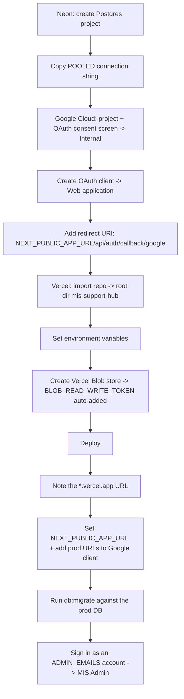
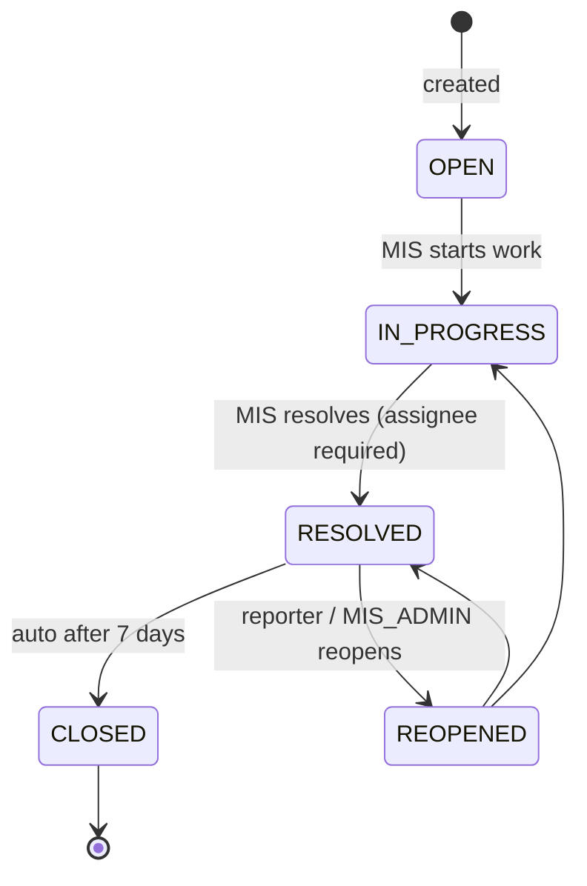
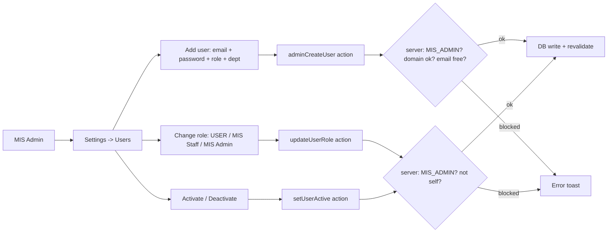

# MIS Support Hub — System & Setup Flow

End-to-end map of how the app is **provisioned, deployed, and run**. For the
locked architecture/data-model see [`CLAUDE.md`](./CLAUDE.md); for env details
see [`README.md`](./README.md). This doc is the "how it all fits together" view.

- **App:** internal MIS support ticketing for the LINKD textile group
  (departments: LINKD, LD Silk Mills, VHAGAR, LD Cotton Mills).
- **Stack:** Next.js 15 (App Router, Server Actions) · Neon Postgres + Drizzle ·
  Auth.js v5 (Google SSO **+** email/password) · Tailwind + shadcn/ui · Vercel
  Blob (files) · Resend (email) · hosted on Vercel.

---

## 1. Provisioning / "create project" flow

The one-time setup to bring an environment online. Do it once for production
(and optionally a separate staging DB).



### 1.1 Database (Neon)
- Create/choose a Neon project. Copy the **pooled** connection string
  (`...-pooler...`, `?sslmode=require`) → `DATABASE_URL`.

### 1.2 Google OAuth (for "Continue with Google")
- Google Cloud Console → project → **OAuth consent screen**, audience
  **Internal** (only `linkdprints.com` Workspace accounts; no Google review).
- **Credentials → Create client → Web application**:
  - **Authorized JavaScript origins:** `http://localhost:3000` and
    `https://<your-domain>` (bare host — no path, no trailing slash).
  - **Authorized redirect URIs:** `http://localhost:3000/api/auth/callback/google`
    and `https://<your-domain>/api/auth/callback/google`.
- Copy **Client ID → `AUTH_GOOGLE_ID`**, **Client secret → `AUTH_GOOGLE_SECRET`**.

> The production origin/redirect can only be added **after** the first deploy
> (you need the real Vercel domain). Create the client with just `localhost`
> first, then edit it once the domain exists.

### 1.3 Vercel
- Import `harshalilinkd/mis-support-hub`, **root directory = `mis-support-hub`**
  (repo root — it's a single Next.js app, not a monorepo).
- Framework preset **Next.js** is auto-detected.
- Create a **Blob** store (Storage → Create → Blob) → injects
  `BLOB_READ_WRITE_TOKEN` automatically.

### 1.4 Environment variables

| Var | Purpose |
| --- | --- |
| `DATABASE_URL` | Neon pooled connection string |
| `AUTH_SECRET` | `npx auth secret` — **fresh** value in prod |
| `AUTH_GOOGLE_ID` / `AUTH_GOOGLE_SECRET` | Google OAuth client |
| `ALLOWED_EMAIL_DOMAINS` | e.g. `linkdprints.com` — **required in prod**; gates **both** Google and email/password sign-up |
| `ADMIN_EMAILS` | emails auto-promoted to `MIS_ADMIN` on sign-in |
| `BLOB_READ_WRITE_TOKEN` | added by the Blob store |
| `RESEND_API_KEY` / `EMAIL_FROM` | email (optional; unset = emails skipped) |
| `NEXT_PUBLIC_APP_URL` | public base URL (set after first deploy, then redeploy) |

> `DEV_AUTH_STUB` / `DEV_STUB_ROLE` / `DEV_STUB_ID` are **dev-only** and never
> honoured in production — do not set them on Vercel.

### 1.5 Migrate + go live
- `npm run db:migrate` applies migrations to the prod DB (latest: `0005` added
  `users.password_hash`).
- Deploy → sign in with an `ADMIN_EMAILS` account → you land on the dashboard as
  **MIS Admin** → manage everyone else from **Settings → Users**.

---

## 2. Authentication flow

Two doors, one session. Google SSO is primary; email/password is an additional
door for people without a company Google account. **Both** are gated by the same
`ALLOWED_EMAIL_DOMAINS` allowlist (single source of truth in
[`lib/email-domains.ts`](./lib/email-domains.ts)).

```mermaid
flowchart TD
    L[/login] -->|Continue with Google| G[Google OAuth]
    L -->|Email + password: Sign in| P[signInWithPassword]
    L -->|Email + password: Create account| R[registerWithPassword]

    G --> DZ{domain in allowlist?}
    R --> DZ
    DZ -->|no| X[Rejected]
    DZ -->|yes| ACT{account active?}
    P --> ACT
    ACT -->|no| X
    ACT -->|yes| S[JWT session: id + role]
    S --> HOME{role?}
    HOME -->|USER| MY[/my]
    HOME -->|MIS_STAFF / MIS_ADMIN| DASH[/dashboard]
```

- **Session:** JWT strategy. The token carries `id` + `role`; role is re-read
  fresh from the DB on each sign-in, and `ADMIN_EMAILS` are (idempotently)
  promoted to `MIS_ADMIN`. See [`lib/auth.ts`](./lib/auth.ts).
- **Email/password specifics** ([`lib/actions/auth.ts`](./lib/actions/auth.ts)):
  - Created by **self-signup** or by an **MIS_ADMIN** (Settings → Users → Add
    user). Passwords hashed with **bcrypt** (cost 10).
  - Sign-up **rejects an already-registered email** — you can never set a
    password on an account you don't control (no takeover of a Google account).
  - The `Credentials` provider lives only in `lib/auth.ts` (Node runtime), so
    bcrypt/DB never leak into edge middleware.
- **Route protection:** [`middleware.ts`](./middleware.ts) runs on all `/(app)`
  routes with the edge-safe config; unauthenticated → `/login`.
- **Dev bypass:** with `DEV_AUTH_STUB=true` (non-prod only) the shell renders
  without real auth — see [`lib/dev-session.ts`](./lib/dev-session.ts).

---

## 3. Roles & permissions

| Action | USER (Employee) | MIS_STAFF | MIS_ADMIN |
| --- | :---: | :---: | :---: |
| Raise ticket · see **own** tickets · comment · reopen own | ✓ | ✓ | ✓ |
| See **all** tickets · dashboard · board | ✗ | ✓ | ✓ |
| Assign · change status · change priority | ✗ | ✓ | ✓ |
| Manage users / change roles / activate-deactivate | ✗ | ✗ | ✓ |

Enforced on the **server** in every action/query (never trust the client). A
`USER` can only read tickets where `created_by = session.user.id`.

---

## 4. Ticket lifecycle



- Ticket numbers come from a Postgres sequence (`MIS-1001`, `MIS-1002`, …) —
  never a row count.
- Setting **RESOLVED** requires an assignee. Reopen is allowed only by the
  reporter or an `MIS_ADMIN`.
- **Every mutation** writes a `ticket_activity` audit row in the same batch as
  the change (the audit trail).
- RESOLVED auto-closes after 7 days if not reopened (logic specced; cron
  optional/stub).

---

## 5. User management flow (admin)

`Settings → Users` (nav item + account-menu **Settings**, both `MIS_ADMIN`-only).



- Users appear by **self-provisioning** (after their first sign-in) or by the
  admin **adding** them — Settings → Users → **Add user** creates an
  email+password account with a chosen role/department (`adminCreateUser`:
  MIS_ADMIN-only, domain-allowlisted, rejects duplicate emails). The admin then
  adjusts role / active status.
- **Anti-lockout guards:** an admin cannot change **their own** role or
  deactivate **their own** account.
- Deactivating a user immediately blocks both Google and password sign-in.
- Code: [`app/(app)/settings/users/page.tsx`](./app/(app)/settings/users/page.tsx),
  [`components/settings/users-table.tsx`](./components/settings/users-table.tsx),
  [`components/settings/add-user-dialog.tsx`](./components/settings/add-user-dialog.tsx),
  [`lib/actions/users.ts`](./lib/actions/users.ts).

---

## 6. Notifications flow

Channel-agnostic dispatcher in [`lib/notifications`](./lib/notifications). Every
event writes an **in-app** notification (topbar bell) and, where applicable,
sends **email** via Resend. All sends are best-effort — a failure is logged and
never rolls back the DB mutation.

| Trigger | In-app | Email |
| --- | :---: | :---: |
| Status → RESOLVED / CLOSED | reporter | reporter |
| Ticket assigned | assignee | assignee |
| New comment | other party | off by default |

WhatsApp is a stubbed provider implementing the same interface (logs intent) —
drop-in ready for the WhatsApp Business API later.

---

## 7. Local development flow

```bash
npm install
cp .env.example .env.local     # fill in values
npm run db:migrate             # apply schema to DATABASE_URL
npm run dev                    # http://localhost:3000
```

- Fastest start with no Google setup: set `DEV_AUTH_STUB=true` (+ optional
  `DEV_STUB_ROLE`) in `.env.local` to render the shell as a stubbed user.
- Useful scripts: `npm run typecheck`, `npm run lint`, `npm run build`,
  `npm run db:studio`, `npm run db:clean` (reset seed/test data).

---

_Last updated to reflect: email/password login alongside Google SSO, the
`Settings → Users` admin area (including admin **Add user**), and the
Vercel/Google Cloud provisioning path._
